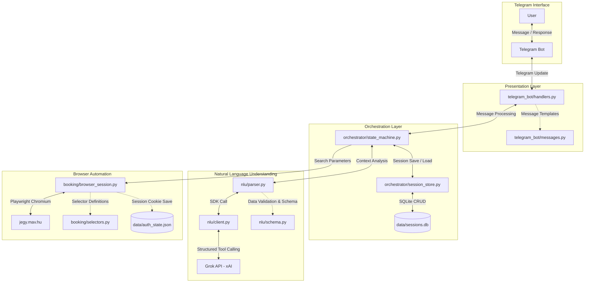

# MAV Ticket Agent - System Architecture and Design

This document describes the working principle, modular structure, database schema, and state machine of the MAV Ticket Agent. The system is designed to interpret natural language (Hungarian) travel requests and automate the ticket booking process on jegy.mav.hu using Playwright.

---

## High-Level Architecture Diagram

---

## System Components and Responsibilities

The application is divided into four distinct layers:

### 1. Presentation Layer (telegram_bot/)
Responsible for direct communication with the user and interaction with the Telegram API.
*   **handlers.py**:
    *   Registers the /start command and handles standard text messages.
    *   Verifies authorized access using ALLOWED_CHAT_IDS.
    *   Catches exceptions and sends user-friendly error messages.
*   **messages.py**:
    *   Contains static and formatted Hungarian message templates.
    *   Provides helper functions to format search results and ticket summaries for Telegram (HTML/Markdown).

### 2. Orchestration Layer (orchestrator/)
The core logic of the application, managing asynchronous message processing and session state persistence.
*   **state_machine.py**:
    *   Implements the state machine.
    *   Routes messages to NLU and Booking parsers based on the current state.
    *   Logs successful/cancelled transactions to logs/transactions.jsonl.
*   **session_store.py**:
    *   Persists chat sessions in an SQLite database (data/sessions.db) keyed by chat_id.
    *   Automatically serializes and deserializes Pydantic models (like TicketRequest) to JSON during database operations.
    *   Manages automatic session expiration (by default, sessions expire and are deleted after 15 minutes / 900 seconds of inactivity).

### 3. NLU Layer (nlu/)
Responsible for converting natural language messages into structured data using the xAI Grok API.
*   **client.py**:
    *   Initializes the connection using the xai_sdk and executes API calls.
*   **parser.py**:
    *   Contains state-dependent functions: parse_ticket_request (extracting journey details), parse_confirmation (detecting yes/no/modification intent), and parse_offer_selection (identifying selected offer).
    *   Instructs the LLM to ask follow-up questions instead of calling the tool if mandatory fields are missing.
*   **schema.py**:
    *   Defines structured schemas using Pydantic (TicketRequest, ConfirmationResponse, OfferSelection).
    *   to_xai_tool converts Pydantic schemas into Strict Tool definitions required by the Grok API, removing redundant metadata to optimize tokens.

### 4. Booking Layer (booking/)
Handles the actual ticket booking automation on the MAV website.
*   **browser_session.py**:
    *   Manages the Playwright Chromium browser lifecycle using context managers (__aenter__ / __aexit__).
    *   Cleans the User-Agent header by removing Playwright-specific strings to prevent bot detection.
    *   Saves and loads session state (cookies) to/from data/auth_state.json to persist the MAV login session.
*   **selectors.py**:
    *   Houses all CSS and XPath selectors for the MAV site in a central dictionary. Only this file needs to be updated if the MAV website changes.

---

## Database Schema (sessions Table)

The database is an SQLite database located at data/sessions.db.

| Field | Type | Description |
| :--- | :--- | :--- |
| chat_id (PK) | INTEGER | Unique identifier of the Telegram chat. |
| state | TEXT | Current state of the state machine (e.g., vár_kérésre). |
| ticket_request | TEXT (JSON) | Serialized version of the TicketRequest model (origin, destination, time, passengers, etc.). |
| search_results | TEXT (JSON) | List of offers retrieved from the MAV search. |
| selected_offer | TEXT (JSON) | Details of the selected offer. |
| message_history | TEXT (JSON) | Complete conversation history (list of role/content dicts) sent to the LLM as context. |
| updated_at | TIMESTAMP | Timestamp of the last modification (used for session expiration). |

---

## Security and Fault Tolerance Guidelines

1.  **User Whitelisting**:
    *   The application only accepts messages from chat IDs specified in ALLOWED_CHAT_IDS within the .env file.
    *   Unauthorized users trigger a PermissionError immediately, and their requests do not query the database.
2.  **Sensitive Data Isolation**:
    *   MAV login credentials (MAV_EMAIL, MAV_PASSWORD) are loaded directly into BrowserSession from environment variables.
    *   Passwords or payment credentials are never added to the AI context (message_history) or written to database logs.
3.  **Fault Tolerance**:
    *   If an unexpected error occurs during browser automation or API calls, the orchestrator catches it, logs details at ERROR level to logs/app.log, deletes the faulty session from the SQLite store, and notifies the user that the session has been reset.
4.  **Dry-run Mode**:
    *   If DRY_RUN=true, the automation proceeds to the final payment page but does not click the final payment button, preventing accidental ticket purchases during testing.
