# 🚄 MÁV Ticket Agent 
A personal AI agent that buys Hungarian train tickets on your behalf through Telegram. You describe your journey in plain Hungarian — the agent handles the search, selection, and payment, asking for your confirmation at every critical step.

---

## 📝 Summary 

MAV Ticket Agent is a Python-based AI agent that connects to Telegram, interprets your natural language ticket requests using the Grok API (xAI), and automates the booking process on jegy.mav.hu using Playwright. It is designed for personal use — only whitelisted Telegram accounts can interact with the bot.

The agent never takes irreversible action without your explicit approval. Two confirmation checkpoints are built into every booking flow: one before searching, and one before payment.

---

## 🔧 How it works

You send a message to the Telegram bot describing the ticket you want. The agent parses your request, asks for clarification if anything is missing or ambiguous, then walks you through the booking step by step.



### Under the hood

Every message goes through three independent layers:

**NLU layer** — The Grok API (xAI) parses your message into a structured ticket request using function calling and Pydantic schemas. If the departure station, destination, or travel date is missing or ambiguous, the agent asks a follow-up question instead of proceeding with incomplete data.

**Orchestration layer** — A per-user state machine tracks exactly where each conversation is in the booking flow. State is persisted in SQLite so nothing is lost between messages, even if the bot restarts.

**Booking layer** — A Playwright-based browser automation module operates jegy.mav.hu on your behalf: filling in the search form, reading available trains from the results page, selecting seats based on your preferences, and completing checkout. Payment credentials are handled in an isolated module and are never passed to the AI or written to any log.

### ✅ Confirmation checkpoints

The agent requires your explicit confirmation at two points before any money is spent:

1. After parsing your request — to confirm it understood you correctly before searching
2. Before final payment — showing the exact train, seat, and total price

### 🔒 Security

Only Telegram accounts listed in `ALLOWED_CHAT_IDS` can use the bot. Every incoming message is checked against this whitelist before any processing begins. Payment credentials are loaded directly from environment variables and never appear in logs or in any AI context.

---

## ⬇️ Installation

**Requirements**

- Python 3.11 or higher
- A Telegram bot token (from @BotFather)
- An xAI API key (from console.x.ai)
- A MÁV account registered on jegy.mav.hu
- Your Telegram chat ID (from @userinfobot)

**Steps**

Clone the repository:

```bash
git clone https://github.com/yourname/mav-ticket-agent
cd mav-ticket-agent
```

Install dependencies:

```bash
pip install -r requirements.txt
```

Install the Playwright browser:

```bash
playwright install chromium
```

Set up environment variables — create a `.env` file in the project root:

```
TELEGRAM_BOT_TOKEN=your_telegram_bot_token
XAI_API_KEY=your_xai_api_key
MAV_EMAIL=your_mav_account_email
MAV_PASSWORD=your_mav_account_password
ALLOWED_CHAT_IDS=your_telegram_chat_id
DRY_RUN=true
```

---

## ▶️ Running

Start the bot:

```bash
python main.py
```

The bot will start polling for messages. Open Telegram, find your bot by its username, and send it a message describing the ticket you want.

For the first run, keep `DRY_RUN=true` — the agent will go through the entire flow including the confirmation steps, but will stop before making a real payment. Set it to `false` only when you are confident everything works correctly.

---

## 📂 Project structure

```
mav_telegram_agent/
├── main.py                      # entry point
├── config/
│   └── settings.py              # environment variable loading
├── telegram/
│   ├── handlers.py              # incoming Telegram message handling
│   └── messages.py              # all user-facing text in one place
├── orchestrator/
│   ├── state_machine.py         # per-user booking flow logic
│   └── session_store.py         # SQLite-backed session persistence
├── nlu/
│   ├── schema.py                # Pydantic models and xAI tool definitions
│   ├── client.py                # xAI API wrapper
│   └── parser.py                # state-aware NLU dispatch
├── booking/
│   ├── browser_session.py       # Playwright browser management
│   ├── selectors.py             # jegy.mav.hu CSS selectors
│   ├── search.py                # train search automation
│   ├── seat_selection.py        # seat preference handling
│   ├── checkout.py              # cart and order summary
│   └── payment.py              # payment (isolated, no logging)
├── data/
│   └── sessions.db              # SQLite session database (auto-created)
└── logs/
    ├── app.log                  # application logs
    └── transactions.jsonl       # transaction history (JSON Lines)
```

---

## ❗ Disclaimer

This project automates a browser session on jegy.mav.hu for personal use only. It is not affiliated with or endorsed by MAV-START. Use responsibly and in accordance with the terms of service of jegy.mav.hu.